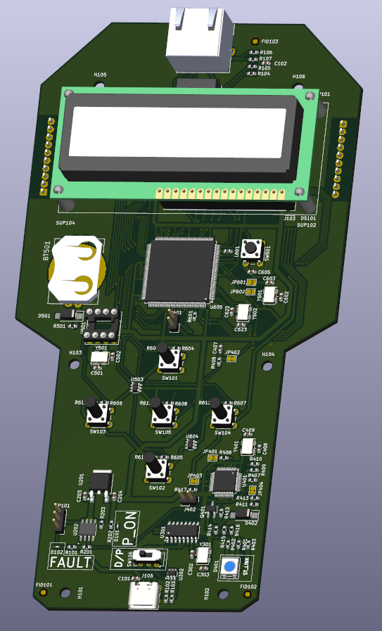
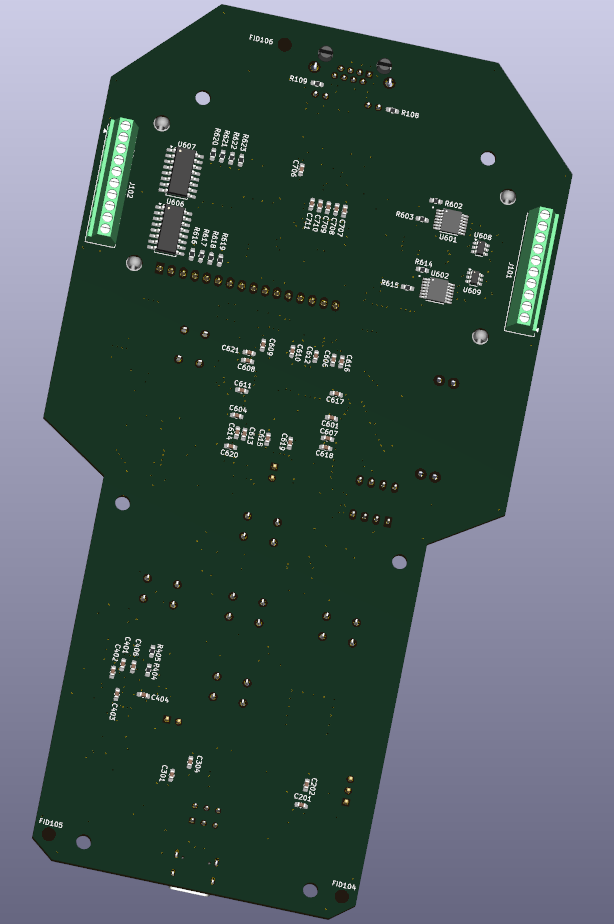
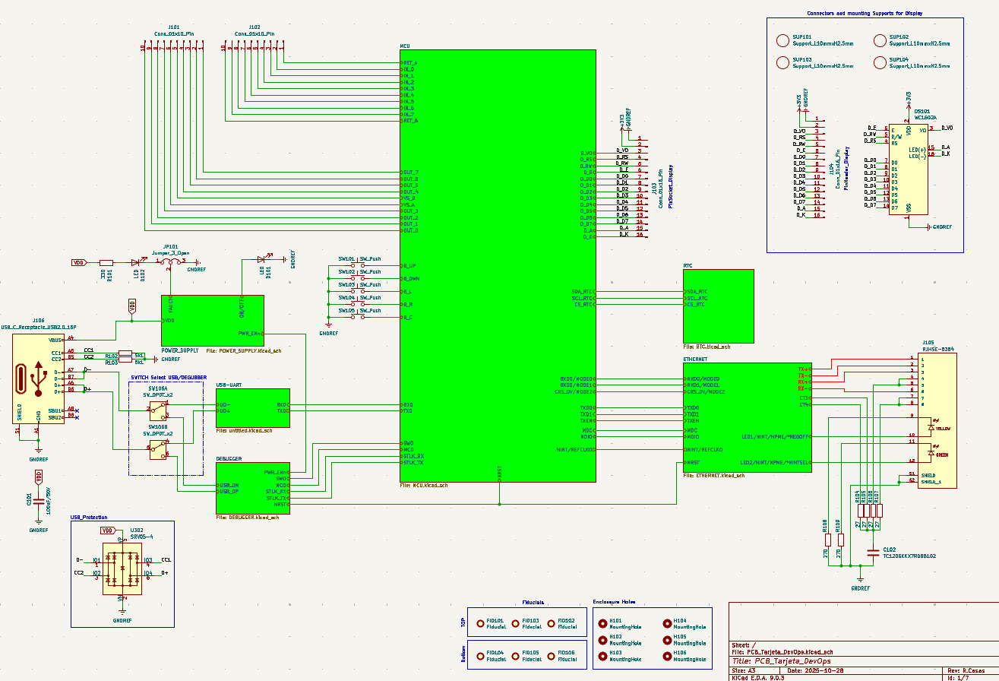
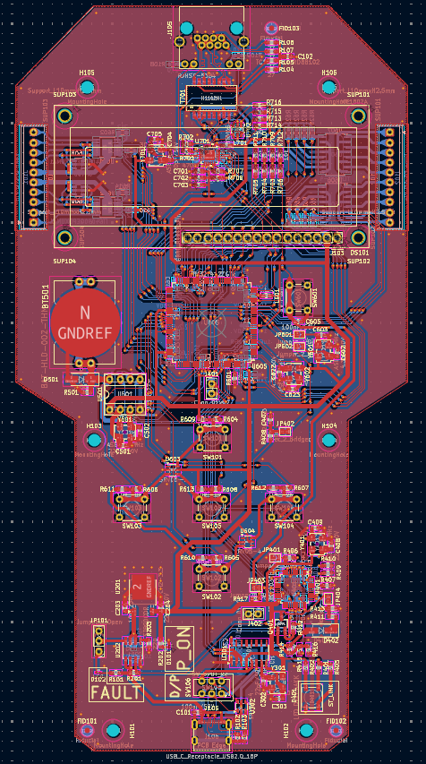

# ⚙️ PCB_Tarjeta_DevOps
**Generic Development Console with Ethernet and USB Connectivity**

---

  

---

## 📘 Overview
**PCB_Tarjeta_DevOps** is a versatile, custom-designed console PCB created primarily as a **personal exercise in complex two-layer design and Ethernet integration**.  
It serves as a **general-purpose development board** adapted from the **ST Nucleo-F412ZG** design, focusing on practical layout challenges and signal-integrity learning (Ethernet, differential pairs, impedance control).

  
  
   
  <em>3D renders of the PCB_Tarjeta_DevOps — Top and Bottom views</em>

---

## ⚙️ General Information
- A **general-purpose console**, not intended for a specific application.  
- Designed as a **learning exercise**, implementing many components on only **two layers** to increase design difficulty.  
- Served as an **introduction to Ethernet PCB layout**, including **differential pair routing** and **impedance control**.  
- Several schematic blocks were **adapted from the ST Nucleo-F412ZG** for familiarity and reference.  

  
   
  <em>Full schematic diagram of the PCB_Tarjeta_DevOps (KiCad 9)</em>

---

## 🔧 Characteristics
- Acts as a **multi-purpose development console**.  
- Supports **USB power and programming**.  
- Integrates **Ethernet connectivity** with differential pair routing and impedance matching.  
- Includes **8 Inputs and 8 Outputs**:  
  - **Outputs for industrial/power use** driven by **ITS4090QEPDXUMA1** — up to **1.5 A** each, suitable for **24 V industrial control**.  
  - **8 isolated outputs** using **TLP290-4** optocouplers (potential-free, up to 24 V).  
- Features a **hardware switch selector** to toggle between **programming** and **debugging** modes.  
- Includes a **real-time clock (RTC)** with **CR2032 battery backup**.  
- Provides **five tactile buttons** for user interaction with the display or user interface.  

  
   
  <em>Top layer routing and overall PCB layout (KiCad 9)</em>

---

## ⚠️ Design Notes
- **Display Section:**  
  - Multiple components in the display area require mechanical supports and connectors.  
  - Some footprints should be marked as **DNP (Do Not Populate)** and clearly specified for **DFM/DFA** purposes.  
- **Ethernet Interface:**  
  - Differential pairs are **impedance-matched to 100 Ω**, validated using **JLCPCB’s impedance calculator** and fabrication stack-up data.  
  - **USB traces** are not impedance-controlled in this revision (planned improvement).  
- **DFM Analysis (JLCPCB DFM tool):**  
  - Found **drilling overlaps** in display-related holes (mechanical supports and signals).  
  - **USB-C footprint issue:** plated hole size **0.60 mm, required >0.61 mm** tolerance.  
- **Silkscreen and Drill Issues:**  
  - Some silkscreen elements **collide with through holes** but remain legible.  
  - **Line width warnings** flagged for narrow silkscreen traces — minor fabrication risk, acceptable in prototype runs.  
- Overall design remains **manufacturable** and **functionally valid**, despite minor DFM flags.  

---

## 🧩 Repository Structure
PCB_Tarjeta_DevOps/

├── schematic/ # KiCad schematic files

├── pcb_layout/ # KiCad PCB layout files

├── gerbers/ # Gerber fabrication files

├── images/ # Rendered visuals (3D, SCH, PCB)

├── firmware/ # Optional MCU firmware (if applicable)

├── LICENSE # Hardware license (CERN-OHL-P v2.0)

└── README.md # Project documentation

---

## 📜 License
This hardware design is released under the **CERN Open Hardware License v2 – Permissive (CERN-OHL-P-2.0)**.  
You are free to use, modify, and distribute this design, provided that:
- The license is included with redistributions.
- Proper credit is given to the original author.

More info: https://cern-ohl.web.cern.ch/

---

## 👤 Author
**Project:** PCB_Tarjeta_DevOps  
**Author:** [Kolicks]  
**Toolchain:** KiCad 9  
**Version:** 9.0  

---

## 🧱 Future Improvements
- Redesign **USB differential pair** routing with impedance control.  
- Correct **DFM-related drilling and silkscreen** warnings.  
- Mark **DNP parts** for display connectors and update BOM.

---

⭐ *If you find this project useful or educational, please consider starring the repository and sharing feedback!*

